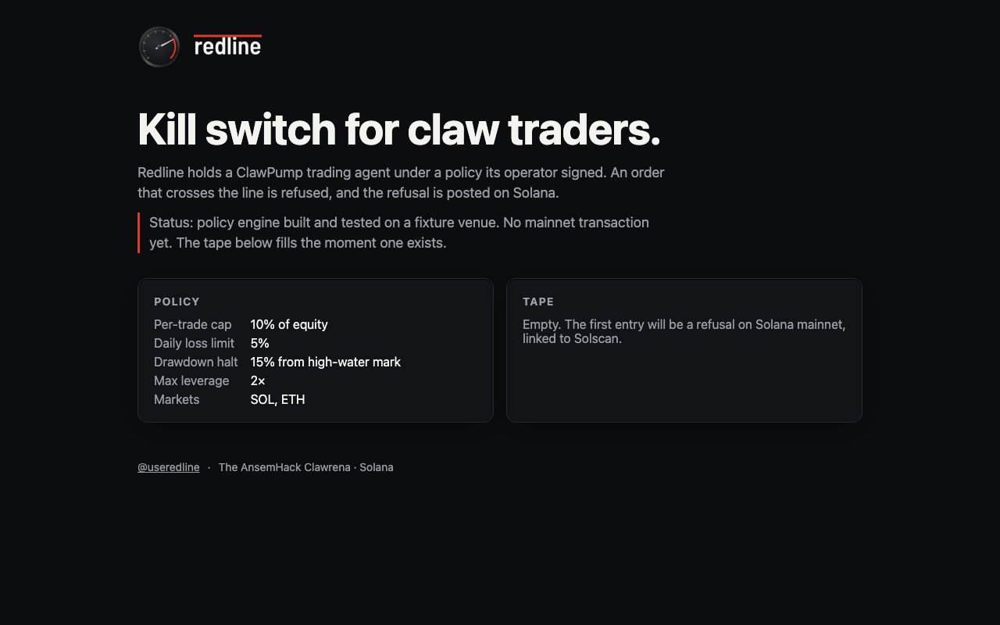
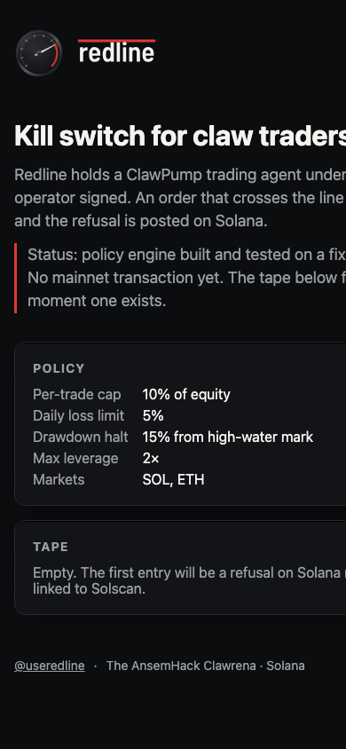

<div align="center">

# Redline


[](https://github.com/Yonkoo11/redline/actions/workflows/tests.yml)


### Kill switch for claw traders.

**Redline is a Hermes plugin that holds a ClawPump trading agent under a policy its operator wrote. Every order the agent tries passes the policy or is refused, and a refusal is written to Solana as a memo carrying the record's hash. Today: 17 refusal rules tested, the real Hermes runtime dispatching through it, and one refusal confirmed on Solana devnet.**

**[ Verify it yourself ↗ ](#verify-it-yourself-in-60-seconds)** · **[ The devnet receipt ↗ ](https://solscan.io/tx/5SaG128xvD4GiW7CCaJRZrGtwBD2paNf9iKWuvoHELfV2u9XjkvKCYBPHRhqYFPrzuPn5SsGNH6mVFSJdieNMZfQ?cluster=devnet)** · **[ @useredline ↗ ](https://x.com/useredline)**

Built for The AnsemHack Clawrena (ClawPump × pump.fun, Inference Markets).

</div>

---

## The tape page

*What the still shows: the shell that is live today. Policy on the left, an empty tape on the right, and a status line that says no mainnet transaction exists yet.*

| desktop, 1280 wide | phone, 390 wide |
|---|---|
|  |  |

## Table of contents
- [The tape page](#the-tape-page)
- [The problem](#the-problem)
- [What Redline is](#what-redline-is)
- [Verify it yourself in 60 seconds](#verify-it-yourself-in-60-seconds)
- [The headline result](#the-headline-result)
- [Architecture](#architecture)
- [The policy](#the-policy)
- [What's real, and what we deliberately did not claim](#whats-real-and-what-we-deliberately-did-not-claim)
- [Tech stack](#tech-stack)
- [Project layout](#project-layout)
- [Run it locally](#run-it-locally)
- [Tests](#tests)

## The problem

- **Trading agents carry their risk limits in the prompt.** Of the 200 newest tokens on ClawPump on 2026-09-18, 111 describe a trading agent; the platform itself offers a daily model-spend budget and a wallet-address whitelist, and no per-trade cap, daily loss limit, drawdown halt or leverage limit (clawpump.tech/docs, read 2026-09-18). A limit in a prompt is a suggestion the model can argue with.
- **A safety net that is never exercised fails when it is needed.** On this team's previous agent (Helmsman, BNB Chain, June 2026) the emergency swap failed both times it was the only defence, because it had never been run in isolation.
- **Holders cannot see the limits at all.** Nothing an operator promises about risk is checkable from the outside.

## What Redline is

A plugin that sits between the model and the tools that move money. The loop:

<div align="center">

**`TOOL CALL → INTENT → POLICY → ALLOW | REFUSE → TAPE`**

</div>

1. **Tool call.** Hermes fires `pre_tool_call` before any tool runs. Redline only looks at money-moving ClawPump tools (`perps_order_execute`, `swap_execute`, collateral withdrawals, transfers). Everything else passes untouched.
2. **Intent.** `redline/intent.py` turns the call into a notional in USD, a market, a leverage and a destination. Anything it cannot price becomes `None`, and `None` is refused.
3. **Policy.** `redline/policy.py` applies, in order: halt flag, equity readable, refusal cooldown, drawdown from high-water mark, daily loss, then scope and size. Fails closed on every unknown.
4. **Allow or refuse.** An allowed call proceeds. A refused call returns `{"action": "block", "message": ...}` and the model sees the reason.
5. **Tape.** `redline/tape.py` appends a hashed record to `tape.jsonl`; refusals are also posted to Solana as a memo (`redline:refused:<hash>`) signed by a separate tape wallet.

## Verify it yourself in 60 seconds

No key, no wallet, no chain access needed for the first two checks. Every line below was run before it was written here; the expected results are in the comments.

```bash
git clone https://github.com/Yonkoo11/redline && cd redline
python3 -m unittest discover -s tests -t .          # → Ran 17 tests ... OK
python3 -c "from redline.policy import *; print(evaluate(Policy(), State(), Intent('perp', 12.0, market='SOL'), 100.0, 0).reason)"
                                                    # → notional $12.00 > cap $10.00 (10.0% of equity)
# with Hermes v2026.9.14+ installed and the plugin linked into ~/.hermes/plugins/redline:
~/.hermes/hermes-agent/venv/bin/python tests/hermes_integration.py
                                                    # → PASS: over-cap refused | in-policy allowed | read-only untouched | rpc-down fails closed
hermes plugins validate ./redline                   # → Validation passed.
```

The first check proves the rulebook. The third proves the installed Hermes runtime routes tool calls through it and honours the block. Neither touches a real venue: equity is a fixture in both, and the mainnet gate below is not yet passed.

## The headline result

Inside the real Hermes runtime (v0.21.3, 2026-09-14 build), with equity fixed at $100 and a 10% per-trade cap:

```
OVER-CAP  -> 'REDLINE refused (trade_cap): notional $100.00 > cap $10.00 (10.0% of equity)'
IN-POLICY -> None
READ-ONLY -> None
RPC DOWN  -> 'REDLINE refused (equity): equity unreadable; refusing (fail closed)'
```

One refusal written to Solana devnet and read back from the memo program logs:

```
Program log: Memo (len 48): "redline:refused:0cc3938cf02060e1bc5f189fc07a0d0a"
```

Live equity of the ClawPump agent wallet `FT5GaRv2eV74aS3dTPw6ZNsVBackGTW9dNQfw4jSZirz`, read from public RPC and Jupiter's price feed on 2026-09-18: `0.151 SOL × $112.90 = $17.05`. Perps collateral is not yet counted (see the honesty table).

## Architecture

```mermaid
flowchart TB
  H[Hermes agent loop] -- pre_tool_call(tool_name, args) --> P[redline/__init__.py]
  P -- intent_from_call --> I[redline/intent.py]
  P -- wallet_equity_usd --> E[redline/equity.py]
  E -- getBalance / getTokenAccountsByOwner --> RPC[(Solana RPC)]
  E -- price/v3 --> J[(Jupiter price)]
  P -- evaluate --> R[redline/policy.py]
  R -- allow --> T[mcp_clawpump_* tool runs]
  R -- refuse --> B["{action: block, message}"]
  P -- write --> W[redline/tape.py]
  W -- solana transfer --with-memo --> M[(Solana memo)]
```

The hook boundary is `redline/__init__.py`; the rulebook is `redline/policy.py`; the two things that touch the outside world are `redline/equity.py` (reads) and `redline/tape.py` (writes).

## The policy

Stored at `~/.hermes/redline/policy.json`. Defaults:

| rule | default | what it does |
|---|---|---|
| `max_trade_pct_equity` | 10 | refuse any order above this share of equity |
| `max_daily_loss_pct` | 5 | refuse new risk once the UTC day is down this much |
| `max_drawdown_pct` | 15 | halt everything once equity is this far under its high-water mark; stays halted until an operator resets |
| `max_leverage` | 2 | refuse above this |
| `allowed_markets` | SOL, ETH | perps outside the list are refused |
| `allowed_tokens` | SOL, USDC | swaps outside the list are refused |
| `allowed_destinations` | none | transfers to anything else are refused |
| collateral withdrawals | always refused | operator-only, by design |
| `refusal_cooldown` | 5 in 30 min | after repeated refusals, refuse everything for the window |
| equity unreadable | refuse | fail closed |
| order unpriceable | refuse | fail closed |

## What's real, and what we deliberately did not claim

| Capability | Status |
|---|---|
| **Policy engine** | Real. 17 unit tests on a fixture venue, `tests/test_policy.py`, run in CI. |
| **Hermes runtime dispatch** | Real. `tests/hermes_integration.py` passes inside the installed Hermes v0.21.3; `hermes plugins validate` clean. |
| **Refusal on Solana** | Real on devnet, one transaction, linked above. Not yet on mainnet. |
| **Live equity** | Measured, not asserted: SOL and USDC in the agent wallet, priced by Jupiter. Phoenix perps collateral and open positions are not counted yet; until they are, the reader under-counts, which errs toward refusing. |
| Mainnet fill and mainnet refusal (the Phase 1 gate) | Not done. Waits on the ClawPump MCP being wired into Hermes and the tape wallet being funded. |
| Pair-trading strategy (SOL vs ETH on Phoenix) | Not built. |
| Decisions bought from UsePod over x402 | Not built. |
| Referee mode for hosted ClawPump agents | Not claimed, anywhere in this repository. Hosted agents cannot load a plugin. |
| Realised trading performance | Not claimed. No trade has been made. |

## Tech stack

- **Plugin:** Python 3.11+, standard library only · **Tests:** 17 unit + 1 runtime integration, in CI · **Runtime:** Hermes Agent v2026.9.14+ (`pre_tool_call` hook) · **Site:** Svelte 5 + Vite, static · **Chain:** Solana mainnet, memo program via the `solana` CLI; devnet for the proof above

## Project layout

```
redline/
  __init__.py     # the Hermes hook: pre_tool_call → intent → policy → block or allow → tape
  policy.py       # the rulebook; pure functions plus a small state file; fails closed
  intent.py       # tool call → Intent; anything unpriceable becomes None
  equity.py       # wallet SOL + USDC priced by Jupiter, read from Solana RPC
  tape.py         # hashed records to tape.jsonl; refusals posted as Solana memos
  runtime.py      # wires the live readers in when Hermes loads the plugin
  plugin.yaml     # Hermes manifest
tests/            # 17 unit tests (fixture venue) + hermes_integration.py (real runtime)
site/             # the tape page (Svelte + Vite)
probe/            # measured facts: Phoenix markets, ClawPump token field, dated
design/logo/      # the mark, wordmark, and the rounds that were rejected
.github/workflows # tests.yml (CI), pages.yml (site)
```

## Run it locally

```bash
python3 -m unittest discover -s tests -t .                       # the rulebook
ln -sfn "$PWD/redline" ~/.hermes/plugins/redline                  # link the plugin into Hermes (v2026.9.14+)
hermes plugins validate ./redline && hermes plugins enable redline
mkdir -p ~/.hermes/redline && echo '{"agent_wallet":"<your ClawPump agent wallet>"}' > ~/.hermes/redline/config.json
cd site && npm install && npm run dev                             # the tape page
```

## Tests

```bash
python3 -m unittest discover -s tests -t .   # → Ran 17 tests ... OK
```

They cover every rule in the policy table, the intent mapping for both ClawPump MCP prefixes, the block return shape, the tape record, and fail-closed behaviour when equity cannot be read. CI runs them on every push: `.github/workflows/tests.yml`.
